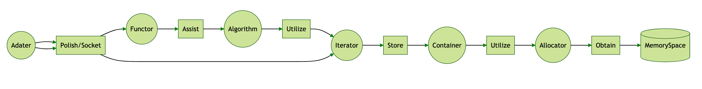
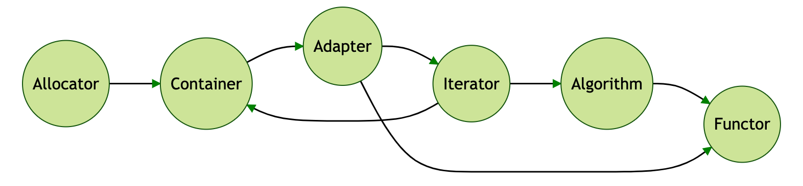

# mySTL

My re-implementation and notes of STL by C++, rust and so on.

# The Relationship of STL 

- ```Container``` obtained Memory Soace by ```Allocator```
- ```Algorithm``` stored ```Container``` by ```Iterator```
- ```Functor``` could assist ```Algorithm``` to finish different strategy.
- ```Adaptor``` could polish or socket ```Functor``` and ```Iterator```

  
  
# The Sequence to Re-implement STL

  


