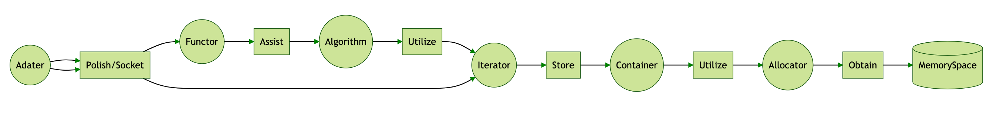
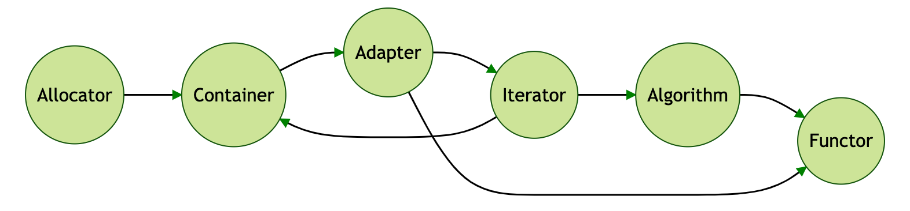

# The Relationship of STL 

- [```Container``` ](./container/README.md)obtained Memory Space by [```Allocator```](./allocator/README.md)
-[ ```Algorithm```](./algorithm/README.md) stored [```Container``` ](./container/README.md) by [```Iterator```](./iterator/README.md)
- [```Functor```](./functor/README.md) could assist [```Algorithm```](./algorithm/README.md) to finish different strategy.
- [```Adaptor```](./adaptor/README.md) could polish or socket [```Functor```](./functor/README.md) and [```Iterator```](./iterator/README.md)

  
  
# The Sequence to Re-implement STL

  