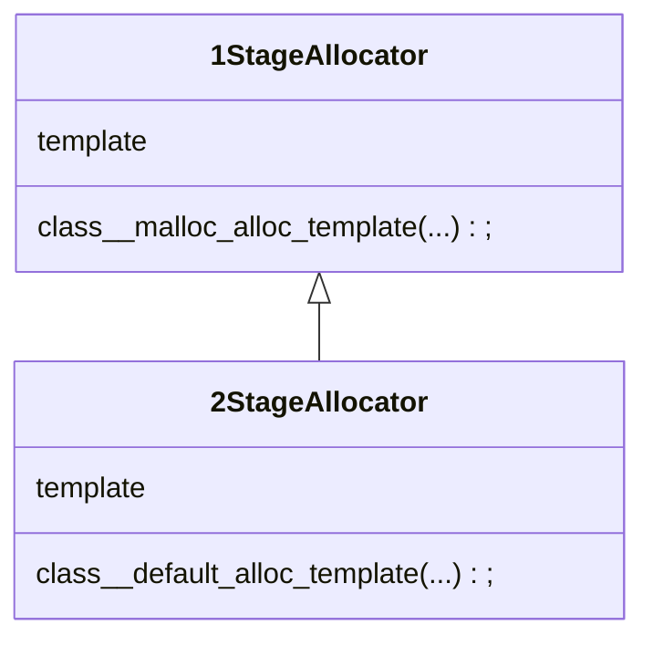

# Allocator

2-stage Allocation.

- If Chunk > 128 bytes, allocate to 1 stage(```malloc()```);
- If Chunk < 128 bytes, allocate to 2 stage(Memory Pool);


```mermaid
classDiagram

1 Stage Allocator <|-- 2 Stage Allocator

class 1 Stage Allocator {
    template <int_inst>
    class__malloc_alloc_template(...);
}

class 2 Stage Allocator {
    template <bool threads, int inst>
    class__default_alloc_template(...);
}

```

